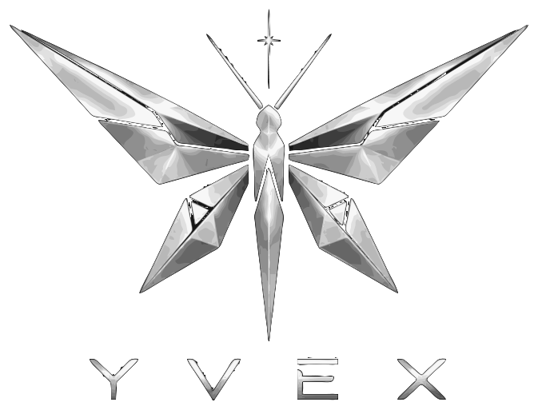
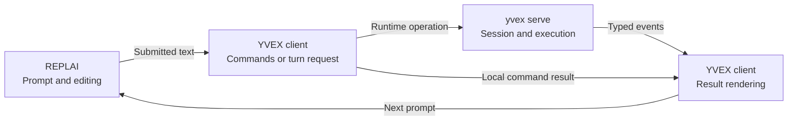

<p align="center">
  
</p>

YVEX is a native C/CUDA model compiler and local inference system for
identity-bound, verified open-weight execution. It compiles authenticated
source facts into immutable packages, specializes them for an admitted
machine, and serves isolated sessions through one persistent local host.

## Why YVEX

A readable checkpoint is not necessarily executable. YVEX separates source
provenance, package meaning, deployment compatibility, engine resources, and
transactional session state. Unsupported implementations, stale identities,
and insufficient resources fail closed instead of silently changing the
requested execution.

The [system architecture](docs/architecture/system.md) explains these owners.
Code and tests establish capability; documentation describes its limits.

## Available execution

| Model boundary | Demonstrated path | Limit |
| --- | --- | --- |
| [DeepSeek-V4-Flash-DSpark](docs/model-families/deepseek-v4-flash.md) | Source-to-text, target-only and target-verified speculative generation | Operational execution is not release quality or performance qualification |
| [Qwen3.8-27B text](docs/model-families/integration.md#current-family-boundaries) | Hybrid attention/recurrent execution and retained hosted text sessions | Text-only; unexecuted source components do not confer vision capability |
| [MiniMax-H3 FL2VA](docs/model-families/minimax-h3.md) | Composite conditioning, iterative execution, and typed synchronized-media publication | Component numerics and a completed trajectory do not prove useful full-model output |
| [Mamba2 / Mamba-Codestral](docs/model-families/mamba2.md) | Pinned acquisition, tensor roles, recurrent-state and CPU component evidence | Partial: no complete artifact, READY deployment, load, or hosted generation |

Use `model show` for actual deployment lineage and blockers, and `model active`
for current engines. This table is not a promise that every checkpoint in a
named family can be prepared on every machine.

## Quick start

### 1. Build

The build requires a C11 compiler, GNU Make, Python 3, pkg-config, current
stable Rust/Cargo, and the platform development libraries selected by the
Makefile, including zlib and threads.
CUDA additionally requires a compatible NVIDIA driver and toolkit. Provider
acquisition uses installed provider tooling; Hugging Face access uses `hf`.
Weights are acquired separately and never included in Git.

Chat statically consumes [pinned REPLAI](docs/decisions/0007-external-terminal-editor.md);
its verified producer is built automatically without a sibling checkout.

```sh
make info
make -j4 all
./yvex help
```

Without `nvcc`, a build does not qualify CUDA execution. See
[contribution setup](CONTRIBUTING.md#set-up-a-development-checkout) for QA
prerequisites and the [runbook](docs/operator-runbook.md) for diagnostics.

### 2. Acquire and prepare

```sh
./yvex model search "MODEL"
./yvex model pull hf://OWNER/REPOSITORY --format safetensors --dry-run --verbose
./yvex model pull hf://OWNER/REPOSITORY@IMMUTABLE_REVISION --format safetensors
./yvex model list
./yvex model show MODEL
./yvex model prepare MODEL
```

Replace the placeholders with the repository found by search, the immutable
revision resolved by the dry run, and the logical model reported by the
catalog. A dry run resolves the selected representation without downloading
weights or changing acquisition state. Pulling a source does not establish a
launchable deployment; prepare refuses unsupported compilation.

Provider accounts, local managed/reference sources, variants, cancellation,
and resume belong to the [operator runbook](docs/operator-runbook.md).

### 3. Serve and chat

If `./yvex host status` reports an existing ready host, use it. Otherwise start
the foreground host in one terminal:

```sh
./yvex serve
```

In another terminal:

```sh
./yvex model load MODEL
./yvex model active
./yvex chat --model MODEL
```

The host starts with zero engines and survives model load/unload. Chat is a
client of that host, not another model runtime. Bare `./yvex` prints help.

Inside chat, `/attach PATH` stages a local object for the next turn; multiple
attachments and later multipart turns retain the same session identity.
Attachments do not grant the selected model new input capabilities.
Unsupported combinations are rejected before numerical execution.

After closing dependent sessions and releasing leases:

```sh
./yvex model unload MODEL
```

The runbook owns the complete [startup procedure](docs/operator-runbook.md#first-verified-startup),
session recovery, media execution, inspection, and shutdown.

## The interactive loop

The classical **Read–Eval–Print Loop** separates input, evaluation and result
presentation; [SICP §4.1.4](https://sicp.sourceacademy.org/chapters/4.1.4.html)
is the teaching reference. In `yvex chat`, those responsibilities span an
external terminal editor, a product client and the existing runtime host:



REPLAI owns terminal mechanics; YVEX owns the meaning of input and output.
See the [system's interactive path](docs/architecture/system.md#interactive-terminal-path)
and [REPLAI's classical REPL guide](https://github.com/mothx9/replai/blob/master/docs/repl.md)
for the complete decomposition and historical references.

## Product boundary

YVEX owns typed execution, published model capabilities, engine availability,
resource admission, and transactional results. Multiple engines may coexist
when resources allow; explicit auxiliary leases do not replace a primary
session's selected model.

Application policy, user media capture, provider routing, cognitive roles,
and tool execution belong to consumers. The reference CLI is a linear
provider client, not an application harness. HTTP clients use the bounded
[OpenAI compatibility profile](docs/openai-compatibility.md), not an implied
implementation of every upstream API.

## Current limits

- Family support is evidence- and representation-specific. Mamba2 preparation
  still refuses READY; MiniMax's full-scale numerical/behavioral boundary is
  open.
- Cooperative runnable concurrency is not continuous batching. Physical
  execution width and engine/resource capacity are separate facts.
- UMA device-addressability does not prove physical page residency. Explicit
  device allocation is not the total GPU working set.
- Model behavior evaluation, release benchmarking, and release qualification
  remain open. Characterization numbers are not release claims.
- CPU and admitted CUDA paths exist; other backends are not implied.

## Documentation

- [Documentation map](docs/README.md): current owners and reading routes.
- [ROADMAP](ROADMAP.md): accepted macro state and next project boundary.
- [Family integration](docs/model-families/integration.md): evidence ladder
  from source interpretation to executable model.
- [Contributing](CONTRIBUTING.md), [AGENTS](AGENTS.md), and
  [engineering method](docs/development/agentic-engineering.md): contribution
  workflow, mandatory agent rules, and evidence-driven progression.
- [Support](SUPPORT.md), [security](SECURITY.md), [license](LICENSE), and
  [notices](NOTICE.md): assistance, trust boundary, and attribution.
