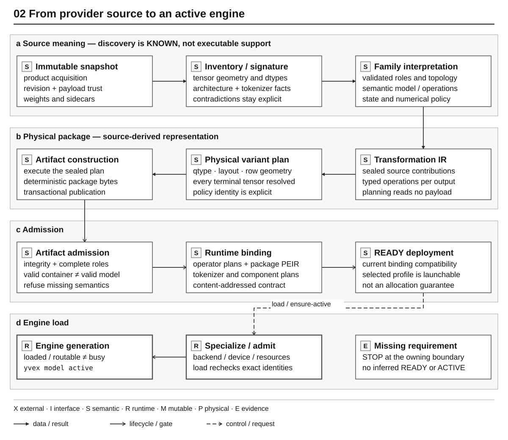

# Compilation and Artifact Architecture

Status: current implemented architecture

This document owns the explanation of how YVEX turns an identified source
snapshot into an admitted physical artifact and runtime binding. Normative
artifact requirements are in the [Artifact and Admission Contract](../contracts/artifacts.md).

## Pipeline

```text
verified source snapshot
  -> logical model and canonical tensor roles
  -> immutable transformation plan
  -> policy-selected physical variant
  -> deterministic transformation execution
  -> complete GGUF artifact
  -> artifact admission and materialization
  -> content-addressed runtime binding
```



The editable source is
[`physical_compilation.mmd`](../diagrams/physical_compilation.mmd).

## Source intake and trust

Source intake records repository/revision, configuration, tokenizer sidecars,
shards, tensor names, shapes, dtypes, and byte ranges. Structural inventory and
payload trust are separate. A source can be inventoried without having every
payload digest authenticated.

The retained source snapshot is immutable and indexed. Downstream owners
consume typed facts and exact bounded ranges; they do not rescan source headers
or infer semantics from filenames.

Payload admission has an explicit bootstrap boundary. `compile source verify`
promotes verified metadata/header provenance to source-manifest v3 only after
reading every shard and matching its authoritative provider SHA-256. The v3
manifest lives outside the source snapshot, binds the ordered aggregate payload
identity, and can be reopened without a second full payload pass. Transformation
planning still consumes zero payload bytes; execution admits ranges only from
that trusted identity.

## Logical projection and transformation

Family owners interpret exact source facts into model topology and canonical
roles. The transformation plan then binds every terminal output tensor to its
ordered source contributions and typed operations. Plan construction is
artifact-neutral and payload-free.

Transformation execution reads only the ranges named by the sealed plan. It
may select, concatenate, permute, aggregate, scale, convert, or quantize as
declared. It may not rediscover axes, expert ordering, companion scales, or
qtype policy from source names.

## Physical policy

A physical variant resolves storage dtype/qtype, row geometry, layout,
alignment, aggregation, and placement constraints for every terminal tensor.
The policy is part of the variant identity. Quantization codecs and qtype
geometry are canonical owners, while selection of a qtype for one tensor is a
physical-policy decision.

Writer and runtime owners consume the resolved variant. They do not pick a
different representation for convenience.

## Artifact emission and admission

The GGUF writer plans exact metadata, tensor directory order, alignment,
padding, ranges, and payload bytes before transactional publication. Native
reader and global-layout owners independently validate the emitted container.

Complete-artifact admission additionally binds model metadata, tokenizer
facts, every required tensor role, qtype support, source/derivation/variant
identities, and exact file identity. Structural GGUF validity is necessary but
not sufficient.

Materialization produces checked backend-addressable tensor views and resource
ownership. It does not execute a graph or establish support for a model.

## Runtime binding

The runtime binding is a separate content-addressed object. It bridges the
admitted artifact to runtime descriptors, physical tensor locations,
executable requirements, numerical identities, and compatibility constraints.
The warm runtime reopens and authenticates it rather than rebuilding compiler
plans.

Artifact drift, binding drift, unsupported qtypes, missing roles, resource
overflow, or incompatible runtime requirements refuse before model execution.

## Current DeepSeek compilation

The current `deepseek4-v4-flash-dspark` source inventory contains 72,317
tensors across 48 shards. Exact coverage lowers those source contributions to
1,409 terminal descriptors: 1,328 target-trunk descriptors and 81 DSpark
descriptors. The 3,130-source-tensor and 49-terminal delta from the superseded
checkpoint is explicit; no old-source descriptor remains current authority.

Target and draft scopes preserve target-layer, feature-tap, draft-stage,
expert, scale-companion, and shared-resource coordinates. The Transformation
IR records sharing instead of duplicating payload when two execution plans
consume one tensor. DSpark behavior is typed metadata and plan input, never a
writer-side filename convention.

The bootstrap physical profile is
`deepseek-v4-flash-dspark-bootstrap-q2-v1`. It preserves admitted mixed
IQ2_XXS/Q2_K decisions only at the level of target roles and assigns explicit
conservative precision to new draft control, normalization, feature, Markov,
confidence, and expert roles. The retained DS4 importance matrix is an
identity-bound predecessor prior, not calibration of the DSpark payload; the
two snapshots contain different bytes even for at least one shared tensor
name. Fresh DSpark calibration remains owned by later physical optimization
and evaluation. The bootstrap artifact and binding remain external
identity-bound assets. This profile establishes executable correctness, not
the release variant, quality parity, a benchmark, or optimized GB10 policy.

## Repository boundary

Model weights, source payloads, complete artifacts, runtime bindings,
registries, transformation outputs, and raw evidence stay outside the
repository. Tiny test fixtures are admitted only by their focused test owner.
