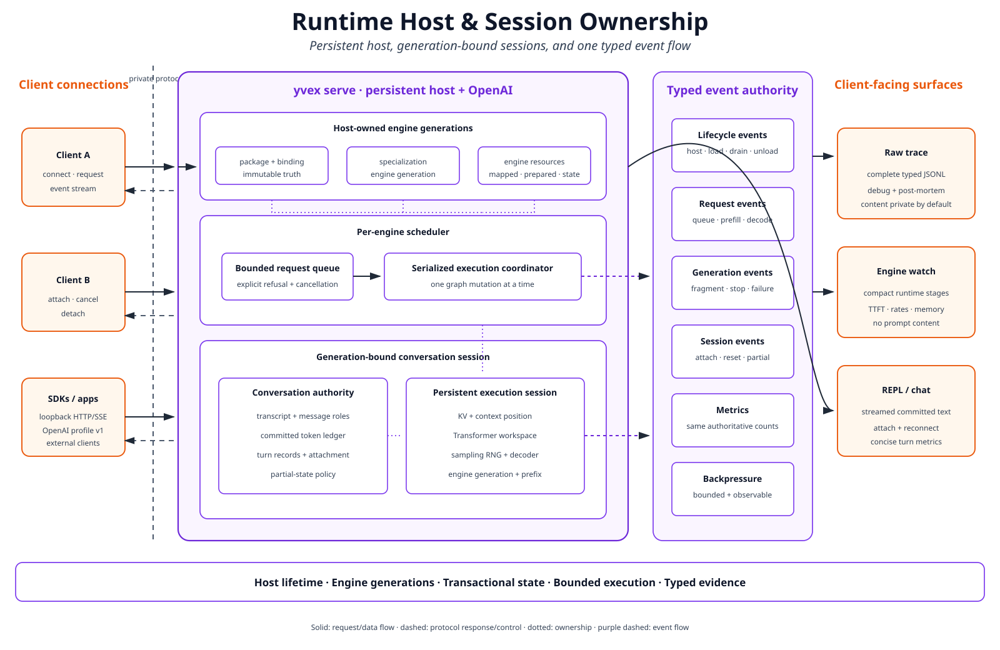
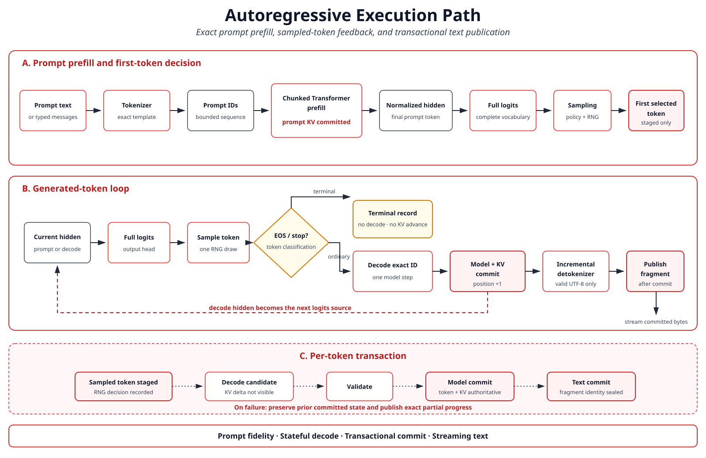

# Runtime and Execution Architecture

Status: current implemented architecture

This document explains the implemented runtime lifecycle, execution pipeline,
persistent state, and resource model. Normative behavior belongs to the
[Runtime Contract](../contracts/runtime.md), [Local Protocol](../contracts/local-protocol.md),
and [Events Contract](../contracts/events-telemetry.md).

## Hosted lifecycle

One foreground `yvex server MODEL` process owns one immutable runtime model from startup until
shutdown. Startup authenticates the complete artifact and runtime binding,
imports descriptors and Physical Execution IR, seals the compiled execution
profile, builds model-lifetime host and accelerator resources, prepares
tokenizer/output-head facts, starts the bounded worker, and publishes readiness
before admitting clients.



The editable source is
[`runtime_host_sessions.mmd`](../diagrams/runtime_host_sessions.mmd).

Shutdown stops new HTTP and local-protocol admission, resolves bounded active
work, closes server sessions, stops the worker, closes the runtime model once,
and releases listeners. A client disconnect is not a model or session close.

## Runtime objects

The immutable runtime model retains:

- the authenticated artifact and binding;
- the Physical Execution IR and compiled execution profile;
- imported family-neutral descriptors, compiled model plan, and generic graph capability;
- read-only encoded weights and model-lifetime backend resources;
- the tokenizer plan and output-head residency;
- target and DSpark draft/verification plans, their shared resources, and
  executable capability and identity facts.

Model open does not resolve a concrete family adapter. Family policy terminates
in the authenticated binding and compiled model plan; runtime instantiates those
facts and uses the common graph execution contract. The explicit startup target
is retained as an immutable product label, not as an execution-policy selector.

Each server session owns one mutable execution session, committed token ledger,
transcript, incremental decoder, sampling/RNG state, turn state, and persistent
target sequence state. A DSpark session also owns bounded proposal and target
verification candidate state. Sessions share immutable weights but never
mutable KV or workspace.

## Execution path

```text
rendered prompt
  -> exact tokenizer IDs
  -> committed-prefix comparison
  -> suffix prefill
  -> complete Transformer
  -> final normalized hidden state
  -> full-vocabulary logits
  -> sampling
  -> sampled-token decode feedback
  -> stop classification
  -> incremental detokenization
  -> committed streamed text
```



The editable source is
[`autoregressive_execution.mmd`](../diagrams/autoregressive_execution.mmd).

Prefill and decode consume the same Transformer and persistent-state boundary.
Decode is a phase, not a second model implementation. Generation composes
tokenizer, prefill, logits, sampling, decode, stop, and detokenization owners;
it does not replace their semantics.

## Target-only and DSpark generation

The same runtime model admits two explicit modes. `target-only` executes one
ordinary target step at a time and remains the semantic reference. `dspark`
captures the source-required target features, constructs a bounded candidate
block with the checkpoint drafter, verifies it with the complete target, and
commits the target-authored accepted result.

```text
committed target state
  -> DSpark proposal and confidence facts
  -> complete-target block verification
  -> accepted prefix plus correction or bonus token
  -> atomic model/token/decoder/RNG commit
  -> committed streaming
```

A proposal does not advance target position, persistent state, transcript,
usage, or output. Target verification retains a prefix-addressable candidate
transaction with ordered state checkpoints. Acceptance promotes the exact
verified checkpoint, rejected suffix state is discarded, and accepted target
rows are not replayed. The only additional target execution is one correction
or bonus token required by the speculative algorithm. Greedy DSpark output
matches target-only output from the same initial state; admitted stochastic
execution preserves the target distribution through exact accept/reject and
residual sampling rather than token-ID equality.

The target plan captures ordered normalized feature taps after layers 40, 41,
and 42 during ordinary execution. The drafter does not rerun the target trunk
to reconstruct them. Draft Markov state is token-conditioned workspace, while
committed sequence truth remains target-owned.

Typed source-output channels constrain the speculative shape. Once the
source-authored reasoning terminator joins the committed prefix, the common
generation owner preserves that prefix, ledger, decoder and RNG and continues
the final channel through target-only decode. The selected DSpark mode remains
visible, while the boundary and exact continuation extent are identity-bound
and projected through phase telemetry rather than hidden as a backend fallback.

## Transformer composition

The DeepSeek adapter supplies the irreducible 43-layer schedule, attention
classes, residual composition, and MoE policy. Generic runtime and graph owners
retain allocation, state transactions, numerical primitives, dispatch,
publication, and cleanup.

The current mixed GB10 execution keeps inter-layer activations on CUDA for the
model backbone and output head. Typed device views carry hidden, expanded
residual, feature, logits, probability, candidate, accepted-prefix and
workspace values with explicit owner, identity, generation, extent, lifetime,
synchronization and materialization policy. Production greedy selection uses a
device argmax and transfers only the selected token and bounded status.
Production CUDA MoE routes compatible rows together, orders row/expert pairs
by expert, executes grouped routed and shared paths, and leaves route arrays on
the device. Each layer transfers only bounded status and unique-expert facts;
one stack completion validates them and reconstructs exact active weight bytes.
A final-stage barrier on the same session stream satisfies completion without a
redundant wait. Its workspace derives from layer qtypes and admitted row capacity
instead of a fixed allocation. The immediate and token-local CPU/CUDA paths
remain the explicit audit/reference oracles; per-layer attention completion
remains optimization debt. Stochastic sampling, incompatible-row output projection,
DSpark generation attention and host-materialized draft/Markov execution remain
explicitly named portable reference adapters. Production CUDA target-feature
reduction publishes the source-selected rows both to bounded host evidence and
to a transaction-owned, token-major device directory. DSpark feature projection
consumes that resident directory without uploading it, executes one width-N
encoded projection plus batched RMSNorm, and passes the normalized device rows
through an identity-bound view to the draft core. The producer seals the one
canonical feature digest; the draft consumer does not rescan the complete host
row to reconstruct that fact. A bounded host copy remains available for the CPU,
audit and forensic oracle. This removes host-authoritative projection arithmetic,
its production re-upload and the normalized-row draft handoff; the retained
feature-evidence D2H remains optimization debt. Target-only CUDA generation selects
full graph execution only when the binding and live Driver capability both admit
it; the compiled profile records whether eager attention remains.
Unsupported CUDA operations fail closed; no requested CUDA execution silently
falls back to CPU.

The CUDA kernel owner emits portable PTX and, for an explicit `sm_121` build,
an independently identified native CUBIN. Module admission selects the native
image only when the runtime device is capability 12.1 and includes image class,
architecture and ordered module bytes in kernel-bundle identity v3. A
competitive native gate refuses PTX-only selection. Binary inspection proves
that the Q8_0-weight/Q8_K-activation row kernel exports the admitted native
entrypoint and contains `IMMA.16816.S8.S8` instructions. Native device tests
require the backend to account a Tensor Core launch and compare decoded output
against the independent qtype codec oracle. This admits that exact integer
Tensor Core operation; it does not imply that every CUDA operation, qtype or
family path uses Tensor Cores.

## Persistent state

Persistent state includes committed position and family-correct attention/KV
representations. It is session-owned and capacity-bounded. Workspace is
separate reusable temporary storage.

CUDA attention graph compatibility binds allocation topology, workspace and
execution shape, not the mutable state generation. Before every capture or
replay, a graph-stream preamble rebinds and refreshes the current committed or
candidate state bank. Promotion may therefore preserve an admitted executable
while reset, invalidation and resource teardown retain their explicit lifetime
boundaries. A preamble failure refuses the launch without publishing state or
discarding an otherwise valid executable.

Production attention graph pieces borrow the session execution stream and
remain ordered with state refresh, later pieces and bounded downloads. They do
not synchronize independently: the existing layer publication barrier proves
all preceding pieces before status, output and candidate state become visible.
Audit timing retains an isolated graph stream and immediate completion. Stream
ownership is part of launch-graph v3 and graph-executable v2 identity; the
execution flags and completion facts are an in-process ABI change only.

The backend registry may hold multiple shape keys beneath one compiled
execution-profile identity. Changing capture bucket or admitted capacity within
one mode selects another key without invalidating compatible executables;
changing mode or upstream execution identity invalidates the old registry.
This lets repeated target decode reuse one executable while prefill and other
exact shapes remain separately keyed.

CUDA session residency owns two device banks for each admitted attention-state
layer and tracks which bank is committed. Normal production attention stages
the complete non-prefix candidate directly from its phase arrays into the
other bank with ordered D2D copies. Commit flips the bank authority; abort
retains the committed bank, and the next non-extension begin clones it before
reuse. The graph provider still materializes the bounded host candidate as the
semantic oracle, but residency does not upload that duplicate state again.
Audit/forensic evidence and prefix-addressable speculative selection retain
their explicit host materialization and H2D path because they consume a
selected checkpoint rather than the final phase state. Counters distinguish
initial/admitted uploads, device staging, and bank cloning.

Token-backed publications advance the logical state identity once per token
and position. Target-only execution, multi-row verification and accepted-prefix
promotion therefore name the same committed state when they publish the same
token sequence. Canonical synthetic probes, which have no token input, retain
their sealed execution identity instead.

The host graph-state provider reserves stable virtual spans for each state
component and commits physical pages only as admitted history ranges become
reachable. Page geometry comes from the capacity plan independently for SWA,
compressed, HCA, indexer, rolling and draft classes; it is not one global token
constant. The pool charges page tables and actual system-page residency before
candidate writes or committed publication. Reset releases physical pages with
the virtual address unchanged. Reference providers without a capacity plan
retain the bounded eager allocation oracle.

Committed host pages can also move under an immutable prefix owner. Capture
converts the exact committed bank extents into sealed shared backing and binds
them to the provider layout, capacity plan and content identity. An empty
compatible provider maps the same backing privately: reads share physical
pages, while the first write to an extended or modified page establishes
copy-on-write private residency. Prefix accounting therefore distinguishes
shared backing bytes, mapped bytes, private resident bytes and live
references. Capture and attach preflight the complete bank set before changing
provider visibility; reset and close drop mappings and references without
making shared state mutable.

The server session owner now consumes this graph-state boundary to expose one
bounded operator-visible session fork. It deep-clones semantic session state,
attaches the immutable backing to an empty child, and publishes the child only
after physical and semantic positions agree. This does not yet provide a
persistent prefix namespace, durable shared-prefix serialization, CUDA-state
sharing or warm prefix TTFT qualification.

On CUDA Driver-VMM hardware, the session residency owner projects the same
logical envelope into two stable virtual device banks per selected layer. It
maps physical allocation granules only for provider-visible committed spans and
pre-admitted candidate growth, uploads and copies only those visible spans, and
refuses resolution beyond each admitted extent. Reset decommits physical
granules without relocating the virtual banks. Its summary keeps virtual bytes,
physical resident bytes, allocation granularity and cumulative commit/release
counts distinct. CUDA implementations without VMM retain the explicit bounded
full-bank fallback.

Normal non-prefix CUDA attention resolves local, compressed and indexer value
history directly in the pre-admitted candidate bank. Generated position arrays
and rolling checkpoints retain their explicit staging, and a local ring that
must wrap retains the bounded phase workspace. Deep-context capacity therefore
does not manufacture a capacity-sized history upload or temporary value array
for an ordinary append.

This device paging removes full-capacity allocation from the admitted GB10 VMM
path; it does not by itself qualify 512K model execution. Full-model attention,
workspace, throughput and continuation evidence at each deep-context band
remain required before deep-context readiness can be published.

An ordinary execution unit follows:

```text
admit -> begin candidate -> execute -> validate -> check cancellation
      -> publish output/state -> commit
```

Failure aborts the candidate and retains the prior committed state. Multi-turn
reuse occurs only when the newly rendered token sequence has the committed
ledger as an exact prefix. The runtime prefills only the suffix; an
incompatible prefix refuses or requires explicit reset.

A speculative cycle extends the same discipline to several positions. Target
attention state uses ordered candidate deltas and checkpoints; SWA uses a
ring-backed contiguous projection instead of moving the complete window.
Compressed, indexer, rolling and mHC state, token ledger, incremental decoder,
target and draft sampling state, and RNG publication participate in one
accepted-prefix transaction. Cancellation before commit discards the whole
candidate. Cancellation after commit reports that exact committed prefix; it
never rewinds published state by decrementing counters.

## Execution profiles and shape admission

One compiled execution profile binds logical model, physical variant, Physical
Execution IR, artifact, materialization, runtime binding, kernel bundle,
hardware, context, generation mode, workload, evidence profile and execution
class. Its typed attention, MoE, and sampling resolutions make every admitted
portable/eager/reference path visible and identity-bearing. Backend code reports
facts; the execution-policy owner chooses `exact` or `compatible-degraded`
before dispatch. `production`, `audit`, and `forensic` evidence are independent from
trace verbosity: production cannot require complete hidden, state, logits, or
probability host scans merely to derive evidence.

The CUDA backend retains a directly tested Q8 activation codec, but compatible
weight qtype establishes kernel capability rather than admission of that
approximation. Production encoded projection, attention and MoE therefore keep
F32 activations until an identity-bound execution profile passes whole-stack
numerical admission. Full forensic attention and token-local MoE comparison
additionally select canonical-order F64 row dots so independent stage oracles
measure semantic execution. Those slower numerical adapters are unreachable
from production and are not performance paths.

Before target prefill/decode, draft, verification, correction, or reset, the
runtime selects an identity-bound execution shape. The shape distinguishes
target/draft scope, phase, operation, width, context band, candidate
visibility, local/compressed/indexer/rolling/candidate capacities, workspace
generation, attention/state/kernel identities, and evidence profile. A missing
compatible shape is admitted as a new eager/reference shape before numerical
mutation or refuses with the exact component, configured and required
capacity, position, width, scope and identities. Target and draft work never
overwrite one shared mutable capacity record.

The model-execution descriptor, a separately sealed hardware profile and an
operator-selected workload profile compile a typed capacity plan. Model,
execution, session and request maxima; pooled state; candidate and prefix
reserves; logical token batch; physical attention, MoE and output rows;
workspace; and system reserve remain distinct facts. Page geometry is selected
per state class from representation blocks, alignment, kernel tiles,
page-table cost, fragmentation, copy-on-write and promotion granularity.

A phase roofline ledger binds active weights, state, activations, temporaries,
transfers, launches, synchronizations, occupancy, duration, work and committed
tokens for prefill layer, decode layer, verification, drafting, output,
promotion and batched decode. Measured bandwidth is mandatory before it can
rank optimization priority. This ledger, rather than a fixed attention/MoE/
output sequence, owns the causal priority decision.

The ledger admits partial causal evidence without inventing facts. It keeps a
stable slot for every phase, reports phase and fact availability separately,
and marks its priority provisional whenever a measured phase lacks the active
byte or movement facts needed for a memory lower bound. A missing phase or
counter is unavailable, never numeric zero.

CUDA generation now builds this ledger for the phases it actually executes,
independently of trace verbosity. Prefill, ordinary decode, output projection,
DSpark draft/verification and accepted-state promotion contribute exact
duration, work and committed-token facts. Target-only prefill and decode add
encoded embedding, attention and expert bytes, decoded final-stage bytes and
kernel launches. One checked compulsory-memory fact owner aggregates measured
and missing operations transactionally. Device-native embedding, attention,
MoE and final projection report their active weights, touched sequence-state
spans, external activation spans and actual temporary workspace; a target phase
earns its complete memory mask only when every contributing operation reports
those facts. Those phases also project exact H2D/D2H/D2D movement and
synchronization from embedding, attention, MoE, selected feature and final-stage
producers. Output projection uses the same fact owner for encoded head bytes,
the compulsory hidden-input/logit-output activation spans, actually allocated
status and Q8-activation scratch, and exact zero persistent-state bytes.
Compatible multi-row CUDA sources use one bounded host upload or one contiguous
device view, prepare activations once, execute the encoded head once and return
one ordered output block. Mixed or non-contiguous directories use the explicit
row-local reference path. Draft and verification merge the resulting aggregate
facts once rather than treating one physical head execution as repeated row
work. Movement remains exact, and greedy selection still performs no full-
vocabulary D2H. Draft and verify sweeps add exact transformer/output launches,
H2D/D2H/D2D movement and synchronization. Their transformer active-byte facts,
occupancy and batched-decode facts remain unavailable, so the global
optimization priority stays provisional. The offline generation operator
exposes the ledger in audit and JSON projections without adding it to protocol
v8 or making trace verbosity a numerical dependency.

Speculative prefill now merges the target transformer, resident feature
projection and draft-core physical records before publishing its phase slot.
The merge is transactional and preserves explicit incomplete memory facts. It
therefore cannot report a future zero for DSpark prefill or turn an unmeasured
operation into a complete roofline lower bound.

Prefix selection also snapshots state-residency counters around its serialized
mutation. Prefix-addressable promotion therefore reports exact H2D and one
synchronization per selected-checkpoint upload, with zero D2H, D2D and kernel
launches. Ordinary non-prefix production separately records exact D2D bytes for
phase-to-candidate staging and committed-to-candidate bank cloning. Temporary
bytes remain unavailable until their owners can report compulsory traffic
rather than allocation capacity. Repeated occupancy is aggregated as a checked
work-unit-weighted mean, never as an additive counter.

## Memory and residency

The process distinguishes file mapping, anonymous host residency, locked or
CUDA-addressable host storage, accelerator-resident storage, session KV,
workspace, and transient staging. Physical unified memory does not collapse
these placement and accounting classes.

The artifact mapping remains immutable model-lifetime backing for admission and
provides exact typed tensor views. When the compiler-sealed physical plan needs
no derived layout, CUDA registers that mapping once as an immutable addressable
range without a complete anonymous model copy or mandatory whole-artifact
prefetch. The backend uses the device pointer returned for that registration;
raw host-pointer addressability is not sufficient. A plan requiring derived
assets selects managed CUDA residency and completes its migration before
readiness instead. The runtime selects between these compiled alternatives
before allocation; the backend cannot substitute one silently. Status reports
mapped artifact extent, host-registration or managed-prefetch facts,
non-artifact host residency, accelerator residency and process RSS separately.
A placement counter is a memory fact, not by itself a causal performance
diagnosis.

Before opening the complete artifact, startup reads the bounded binding and
admits its encoded payload against the configured host budget and the tighter
of current system availability and the process's cgroup-v2 memory hierarchy.
It preserves the greater of 8 GiB and one eighth of that effective capacity;
this scales with the admitted machine or process envelope rather than assuming
128 GiB. Refusal reports configured or available bytes against required bytes
before artifact mutation. First admission authenticates every artifact byte.
Later opens may consume one content-addressed local lease only when the expected
artifact identity and complete filesystem snapshot are unchanged; invalid or
missing cache evidence returns to the full hash. A second live check immediately
before residency construction closes the race introduced by artifact
authentication and import. Process admission therefore does not depend on the
Linux OOM killer.

Residency schema v7 binds the verified artifact and materialization identities,
selected placement and each source/backing extent. Artifact-backed placement
borrows the stable mapping and preserves its lifetime beneath every tensor view;
copied placements retain exact range reads. Both paths retain snapshot-drift,
integrity and cleanup refusal.

Generation retains the derived reserve in its identity-bearing workload and
capacity plans, then checks future state, workspace, graph, scheduler and
reserve bytes against live system/cgroup availability. Dedicated CUDA memory
also constrains the check by current CUDA free memory. Managed or
artifact-backed placement may instead use reclaimable system availability only
when typed backend facts prove the required access and the same physical
capacity. Live availability is deliberately not hashed
into page geometry or capacity identity, so ordinary memory fluctuation cannot
invalidate durable state or change an admitted session layout.

Mutable session resources remain isolated while immutable model caches may be
shared. Allocation, transfer, synchronization, execution, and cleanup failures
retain separate typed classes.

The runtime owns the logical session-state and model-residency lifecycles. It
projects their admitted mappings into an opaque backend through typed attach,
resolve, transfer and generation-publication operations. Concrete backend
allocation state and dispatch remain source-local to `src/backend/`; graph and
runtime owners cannot coordinate their lifecycle by inspecting backend fields.

## Scheduler, queue, and concurrency

One bounded keyed scheduler owns queue order and active-session mutation.
Socket/listener threads parse and project requests but do not mutate model
state directly. A configured worker set can execute independent sessions in
parallel, while one serialization key never has two active operations. The
capacity compiler admits the total sequence count before readiness. Physical
compatible-row continuous batching, multiple hosted models, and distributed
serving are not implemented.

## Publication and observability

Token fragments are published only after model state, decoder state, and
internal text state agree. A failure after committed output produces a typed
partial-turn snapshot containing exact position, committed-token and published
byte counts, state generations and identities, failure class, and reset
requirement. A partial session visibly refuses another ordinary turn until
reset. Cancellation, disconnect, failure, and maximum-token stop remain
distinct states.

One typed event authority carries lifecycle, queue, tokenizer, prefill, first
token, decode, draft, verification, accepted-prefix commit, stop,
cancellation, failure, memory, and listener facts.
Human status, semantic watch, detailed trace, raw JSONL, and metrics are
projections of that authority. Watch groups startup and each request into
coherent units while trace retains detailed events. The REPL incrementally
renders UTF-8 and Markdown across arbitrary protocol fragments without
changing canonical bytes; raw and redirected output remains byte-exact and
free of terminal controls. Explicit reasoning is classified only through the
tokenizer's source-authored channel contract and never by prose inspection.

## Current limits

The DSpark bootstrap path is a correctness baseline and may be slower than
target-only execution. Warm DeepSeek performance remains explicit optimization
debt. The architecture does not claim load-aware confidence scheduling, native
FP4 Tensor Core execution, continuous batching, multi-model hosting,
restart-persistent sessions, public security, model evaluation, a release
benchmark, or release qualification.
