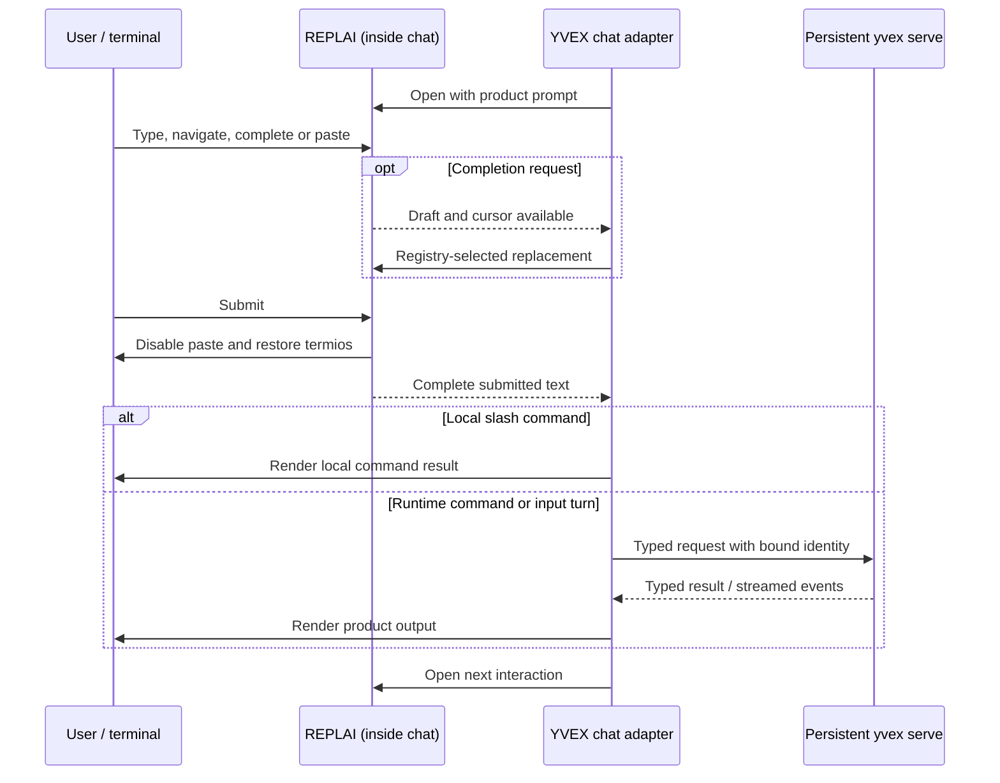

# Implemented YVEX System

Status: current implemented architecture

This document owns the implemented process topology and subsystem boundaries.
It explains the current system; it does not own project state, command syntax,
or release claims.

## System boundary

YVEX is one native compiler and inference system with one product executable:

```text
yvex  foreground model server, protocol clients, and finite offline operations
```

`libyvex` supplies reusable compilation, artifact, runtime, graph, backend,
tokenizer, and generation owners. It is not a process or a separate public
command surface.


The editable source is
[`system_overview.mmd`](../diagrams/system_overview.mmd). The diagram is a
curated explanation, not runtime evidence.

## Product processes

`yvex` has three mechanically separated lanes:

- the runtime-client lane uses the private local protocol for chat,
  runtime administration, sessions, live model inspection,
  cancellation, and the single human/JSON log surface;
- the foreground `serve` lane owns the persistent multi-engine host and its
  independently loaded engine generations;
- the finite offline-engine lane calls admitted library owners for compilation,
  artifact operations, inspection, direct component execution, profiling, and
  system facts.

The runtime-client lane cannot open an artifact, initialize CUDA, execute a
Transformer, or host a model. The offline lane closes all resources before the
process exits and never owns persistent sessions. The server lane is explicit
in the invocation and never shells out to or executes a hidden binary.

The foreground server lane owns one private Unix listener, one loopback
OpenAI-compatible listener, one telemetry authority, and a bounded set of
engine generations. Each loaded engine owns its immutable runtime model,
scheduler, sessions, state, and resources. HTTP and native clients bind work to
an exact alias and generation rather than a process-global model pointer.

## Subsystem direction

The implemented dependency direction is:

```text
core and public ABI
  -> source, GGUF, artifact, model, tokenizer
  -> compilation and graph planning
  -> materialization and runtime
  -> backend execution
  -> generation
  -> evaluation and benchmark

domain facts -> typed results/events -> client render -> client I/O
```

Source owners establish provenance, retained tensor inventories, bounded
payload access, and trust. Compilation owners derive artifact-neutral
transformations and physical policy. GGUF and artifact owners serialize,
parse, authenticate, and admit complete artifacts. Runtime owners import the
binding, prepare immutable model resources, and isolate mutable execution
sessions. Graph and backend owners execute already-admitted operations; they do
not reconstruct model topology.

The product levels are verified source, logical model, family projection,
Transformation IR, quantization decisions, physical variant, Physical
Execution IR, complete artifact, admission, materialization, runtime binding,
deployment specialization, model-engine generation, mutable session, executable
batch, request transaction, workload evidence, benchmark, and release
qualification. These levels are identities and lifecycle boundaries, not
aliases for directories.

## Authority boundaries

| Boundary | Current owner |
| --- | --- |
| Source provenance, inventory, payload trust | `src/source/` |
| Remote provider discovery and remote representation records | `src/accounts/`, `src/model/remote.c`, `include/yvex/catalog.h` |
| Local acquired-source and admitted-package catalogs | `src/model/catalog.c`, `src/model/artifacts/`, `include/yvex/catalog.h` |
| Family source facts, coverage and logical lowering | `src/model/families/` |
| Artifact-neutral transformation and physical policy | `src/model/compilation/`, model compilation owners |
| GGUF container, qtypes, writer, layout | `src/gguf/` |
| Artifact snapshot, integrity, admission, and bounded artifact ranges | `src/artifact/` |
| Backend-owned weight materialization | `src/model/materialization.c`, `include/yvex/materialization.h` |
| Semantic/executable graph and state protocols | `src/graph/` |
| Runtime binding, model engines, specialization, sessions, residency, scheduler | `src/runtime/` |
| Device capability, memory, kernels, launch graphs | `src/backend/` |
| Autoregressive composition | `src/runtime/generation.c` and typed generation owners |
| Persistent host, live engine observation, routing, protocol, telemetry | `src/server/` |
| OpenAI-compatible projection | `src/server/openai/` and `src/provider/` |
| Command metadata and projections | `config/operator/registry.json`, generated descriptors, `src/cli/` |

Family source interpretation and graph recipes occupy separate compilation
levels, described by [family integration](../model-families/integration.md).
Generic runtime and backend owners consume typed plans, not family-name
switches. The current pure-SSM decoder gap remains an explicit admission
barrier rather than an alternate runtime.

The exact source-file ownership manifest is
[`config/source_owners.tsv`](../../config/source_owners.tsv). It is also the
sole handwritten production build-membership list; a checked deterministic
projection supplies Make product classes. Contributor-facing layout and build
ownership rules are in
[Source and Module Ownership](../development/source-ownership.md).

## Application surfaces

The [private local protocol](../contracts/local-protocol.md) carries typed
host/engine lifecycle, exact generation routing, multipart content, leases,
streamed channels, status, progress, and refusals. Incompatible versions are
rejected before fixed-layout records are interpreted.
The in-process OpenAI adapter translates the bounded compatibility profile to
the same protocol/session semantics. Neither transport enters graph, tokenizer,
sampling, or model APIs directly.

The command registry is validated at build time and compiled into `yvex` as
immutable descriptors. It owns operation IDs and projection metadata, not
domain behavior. Human help, JSON discovery, completion, dispatch syntax, and
REPL slash schemas consume that one authority.

## Interactive terminal path

The classical Read–Eval–Print Loop is a useful teaching decomposition for
`yvex chat`. SICP's [evaluator driver](https://sicp.sourceacademy.org/chapters/4.1.4.html)
keeps reading, evaluation and printing distinct. The
[REPLAI guide](https://github.com/mothx9/replai/blob/master/docs/repl.md) explains
that cycle and its historical sources; here the application semantics are
YVEX commands and runtime operations, rather than a Lisp evaluator.



The diagram shows the normal continuing path. Exit commands, EOF and transport
errors take their documented close/recovery paths. REPLAI is statically linked
through C ABI 1 into the client; it is not another process or runtime service.
The exact dependency remains governed by
[the external-editor decision](../decisions/0007-external-terminal-editor.md)
and [`config/replai.json`](../../config/replai.json). Explanatory documentation
on the library's default branch does not advance that pin.

| Responsibility | Implemented owner |
| --- | --- |
| Editing, Unicode cursor, paste framing, history navigation, resize/redraw and input terminal restoration | External REPLAI library |
| Polling events, prompt values, history admission, slash completion and dispatch | `src/cli/io/client.c`, using `config/operator/registry.json` |
| Session binding, requests, reconnect and generation cancellation meaning | YVEX client and typed local protocol |
| Model execution and transactional session state | Persistent runtime host |
| Reply formatting and runtime/status presentation | YVEX CLI render/I/O owners, including `src/cli/io/stream.c` |

Submission ends editing before product output begins. The current chat path
does not provide a concurrently editable prompt during generation. Its quiet
output scope suppresses input echo, and the next interaction reopens the editor.
Ctrl-C while editing is a REPLAI interrupt event; during generation it is handled
by YVEX's cancellation path. Neither the command registry nor those application
decisions enter the library.

The distinction also applies to Print: REPLAI supplies generic prompt/style and
safe notice mechanics, while YVEX chooses and formats semantic results. This
sequence is qualified by [real chat PTY tests](../../tests/repl_pty.sh), their
[consumer assertions](../../tests/replai_consumer.py), and the
[bounded runtime vertical](../../tests/integration/tiny_vertical.sh).

## Current implementation scope

The [family boundary table](../model-families/integration.md#current-family-boundaries)
distinguishes DeepSeek and Qwen text execution, MiniMax composite media
execution, and Mamba2's source/component-only boundary. Their shared owners
do not make their evidence stages interchangeable.

The [runtime architecture](runtime.md) owns generation, selection,
transactional state, and measurement. Admitted CUDA selection can retain
resident logits while tokenizer, RNG coordination, protocol, and orchestration
remain host-owned. There is no all-on-device, quality, release benchmark, or
release-qualification implication. [ROADMAP](../../ROADMAP.md) owns those gates.
