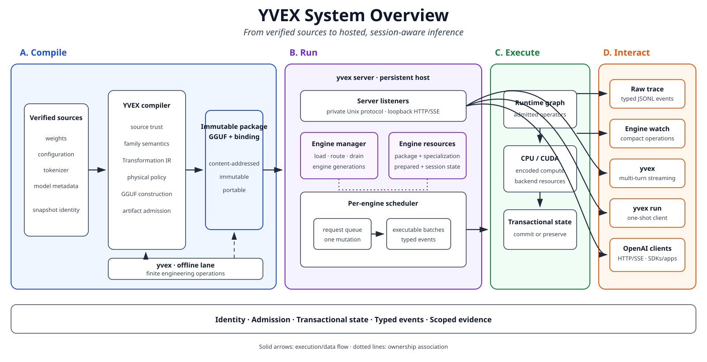

# Implemented YVEX System

Status: current implemented architecture

This document owns the implemented process topology and subsystem boundaries.
It explains the current system; it does not own project state, command syntax,
or release claims.

## System boundary

YVEX is one native compiler and inference system with two product executables:

```text
yvex   finite public command process
yvexd  long-lived local runtime process
```

`libyvex` supplies reusable compilation, artifact, runtime, graph, backend,
tokenizer, and generation owners. It is not a process or a separate public
command surface.



The editable source is
[`system_overview.mmd`](../diagrams/system_overview.mmd). The diagram is a
curated explanation, not runtime evidence.

## Product processes

`yvex` has two mechanically separated lanes:

- the runtime-client lane uses the private local protocol for chat, one-shot
  generation, runtime administration, sessions, live model inspection,
  cancellation, watch, and trace;
- the finite offline-engine lane calls admitted library owners for compilation,
  artifact operations, inspection, direct component execution, profiling, and
  system facts.

The runtime-client lane cannot open an artifact, initialize CUDA, execute a
Transformer, or host a model. The offline lane closes all resources before the
process exits and never owns persistent sessions.

`yvexd` owns one process-lifetime runtime model containing target and DSpark
draft/verification plans, one bounded worker and queue, one server-session
registry, one private Unix listener, one loopback OpenAI-compatible listener,
and one telemetry authority. HTTP and native clients enter the same worker,
model, session, KV, and cancellation owners.

## Subsystem direction

The implemented dependency direction is:

```text
core and public ABI
  -> source, GGUF, artifact, model, tokenizer
  -> compilation and graph planning
  -> materialization and runtime
  -> backend execution
  -> generation
  -> evaluation and benchmark

domain facts -> typed results/events -> client render -> client I/O
```

Source owners establish provenance, retained tensor inventories, bounded
payload access, and trust. Compilation owners derive artifact-neutral
transformations and physical policy. GGUF and artifact owners serialize,
parse, authenticate, and admit complete artifacts. Runtime owners import the
binding, prepare immutable model resources, and isolate mutable execution
sessions. Graph and backend owners execute already-admitted operations; they do
not reconstruct model topology.

The product levels are verified source, logical model, family projection,
Transformation IR, quantization decisions, physical variant, Physical
Execution IR, complete artifact, admission, materialization, optional derived
execution asset, runtime binding, immutable runtime model, compiled execution
profile, mutable session, request transaction, workload evidence, benchmark,
and release qualification. These levels are identities and lifecycle
boundaries, not aliases for directories.

## Authority boundaries

| Boundary | Current owner |
| --- | --- |
| Source provenance, inventory, payload trust | `src/source/` |
| Family source facts, coverage and logical lowering | `src/model/families/` |
| Artifact-neutral transformation and physical policy | `src/model/compilation/`, model compilation owners |
| GGUF container, qtypes, writer, layout | `src/gguf/` |
| Artifact snapshot, integrity, admission, materialization | `src/artifact/` |
| Semantic/executable graph and state protocols | `src/graph/` |
| Runtime binding, immutable model, sessions, residency, workspace | `src/runtime/` |
| Device capability, memory, kernels, launch graphs | `src/backend/` |
| Autoregressive composition | `src/runtime/generation.c` and typed generation owners |
| Hosted model, sessions, protocol, telemetry | `src/server/` |
| OpenAI-compatible projection | `src/server/openai/` and `src/provider/` |
| Command metadata and projections | `config/operator/registry.json`, generated descriptors, `src/cli/` |

DeepSeek has exactly three irreducible implementation projections:
`src/model/families/deepseek_v4.c` interprets source and logical facts,
`src/graph/families/deepseek_v4.c` composes the family execution recipe, and
`src/backend/cuda/families/deepseek_v4.c` owns genuinely fused CUDA lowering.
Their shared basename identifies the same family while their directories and
machine-readable owners identify distinct dependency levels. Runtime remains
family-neutral; a concrete family hierarchy beneath the runtime namespace or a
fourth family projection is forbidden.

The exact source-file ownership manifest is
[`config/source_owners.tsv`](../../config/source_owners.tsv). Contributor-facing
layout rules are in [Source and Module Ownership](../development/source-ownership.md).

## Application surfaces

The private local protocol is version 6. It carries typed requests, streamed
channels, status, session and partial-turn results, progress, terminal results,
and refusals. Version 5 is refused rather than interpreted under the changed
fixed-layout contract.
The in-process OpenAI adapter translates the bounded compatibility profile to
the same protocol/session semantics. Neither transport enters graph, tokenizer,
sampling, or model APIs directly.

The command registry is validated at build time and compiled into `yvex` as
immutable descriptors. It owns operation IDs and projection metadata, not
domain behavior. Human help, JSON discovery, completion, dispatch syntax, and
REPL slash schemas consume that one authority.

## Current implementation scope

The admitted DeepSeek-V4-Flash-DSpark vertical reaches target-only and
target-verified speculative text through one complete artifact, binding,
runtime model, worker, and session authority on CPU and the admitted mixed GB10
path. Candidate tokens remain private until the complete target admits an
accepted prefix; native and HTTP clients see only committed text and usage.

The current CUDA path keeps target and draft model execution on CUDA while
tokenizer work, sampling, protocol handling, and orchestration remain
host-owned. This is not a claim of DSpark acceleration, complete device
residency, model evaluation, release benchmark performance, or release
qualification. Current gates remain in [`ROADMAP.md`](../../ROADMAP.md).
