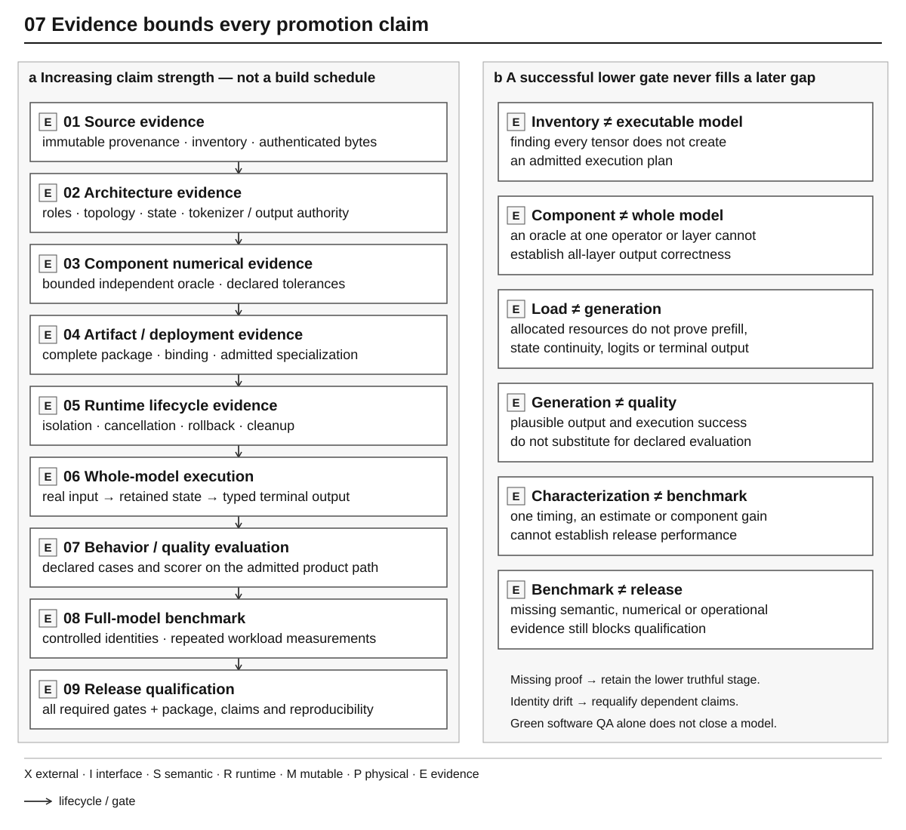

# Agentic Engineering Method

YVEX uses high-context engineering agents to evolve a native compiler and
runtime under explicit ownership and evidence constraints. The unit of work is
a property to establish or falsify, not a transcript of mechanical edits.

## Authorities

| Owner | Responsibility |
| --- | --- |
| [AGENTS](../../AGENTS.md) | Mandatory rules for safely changing the repository |
| This method | How the project designs, verifies, and selects engineering work |
| [ROADMAP](../../ROADMAP.md) | The only live macro project-control surface |
| Code, schemas, and tests | Implemented behavior and executable contracts |
| Git, issues, and pull requests | Implementation chronology and delivery history |
| Private alignment ledger | High-resolution planning/navigation outside Git; not public repository authority |

The [documentation map](../README.md) routes readers to current technical
owners. It is not another status database.

## Frame the outcome

A useful engineering prompt supplies system context, the demonstrated problem,
ownership and invariants, the desired after-state, evidence requirements,
non-goals, destructive boundaries, and closure conditions. Explain enough
rationale for the agent to reason; do not prescribe hundreds of patches that
prevent it from discovering the actual owner.

The ordinary order is archaeology, design, implementation, verification.
Normative instructions constrain real invariants and claims. Implementation
detail remains a reasoned choice after archaeology.

## Reconcile and investigate

Establish branch, HEAD, tree, remote relationship, index, and concurrent work
before mutation. A prompt's checkpoint is a hypothesis until compared with the
repository. Preserve legitimate later work. Re-read mutable regions before
editing or committing, as required by AGENTS.

Trace owners and consumers before adding abstractions. Historical names,
previous plans, and agent reports are evidence to investigate, not the current
architecture. Find where authority ends: source interpretation, compilation,
runtime binding, state lifetime, backend execution, or product projection.

Define the property and its falsifiers. Two requests making progress need not
form a physical batch; parsing all tensors need not create a launchable model.
The implementation must repair the demonstrated boundary, not the vocabulary
that exposes it.

## Apply real reference pressure

When model/provider work requires source evidence, begin with real acquisition
through YVEX and capture the immutable provider revision and selected
representation. A reference name does not establish support. Inspect actual
inventories and conflicting metadata rather than assuming the model card
defines executable truth.

Use independent numerical or behavioral oracles at bounded, reproducible
interfaces. An external implementation is a reference, not a hidden production
execution dependency. Hardware and resource facts must come from the machine
and admitted deployment being qualified.

Implement the demonstrated mechanism before inventing automatic policy.
Generic changes need concrete consumers. A future application or family is
not justification for a parallel loader, state owner, registry, or scheduler.

## Attempt to disprove the result

Qualification follows the property, not the prompt's bullet count. Exercise
negative admission, stale identity, ownership leakage, state corruption,
cancellation, rollback, cleanup, restart/replay, resource failure, and
independent numerical disagreement where relevant. A happy path alone cannot
prove a transactional or fail-closed contract.

Use the registered [QA ownership](qa.md). Keep exact source/tree, artifact and
binding, workload, backend/device, and evidence identity. Controlled performance
comparisons also require matching execution settings, warm/cold state,
contention, repeated samples, and a declared acceptance policy.

## Classify evidence

*Figure 7 — Claim strength and promotion barriers. Each stronger claim needs its
own evidence; this is not a mandatory chronological test schedule. Independent
component numerics do not establish whole-model conformance, and software QA
cannot replace a missing semantic or release gate. No completed gate is implied.*
[Editable source](../diagrams/evidence_promotion.json).

Promote only to the lowest stage actually demonstrated. Preserve explicit
refusals and gaps. Missing evidence cannot be converted to a pass by a renderer,
a plausible output, an optimistic report, or a renamed milestone.

## Verify the delivery

Treat the closure report as a set of testable claims. Independently reconcile
HEAD, tree, remote branch, ancestry, actual diff, claimed implementation,
fail-closed behavior, test definitions/registration, and documentation state
where observable. A successful push alone is not remote identity verification.

Separate remote-verifiable repository facts from local runtime evidence whose
artifacts are not published. Record the latter's identity and location, but do
not imply an independent reviewer reproduced it merely by reading the commit.

Raw profiles and execution dumps stay outside Git. A current evidence owner
retains the smallest necessary identity, result, non-claim, and evidence pointer.

## Decide progression

| Decision | Meaning |
| --- | --- |
| `proceed` | The implemented boundary is consumer-safe and required evidence is complete |
| `repair_same_boundary` | A demonstrated semantic or implementation gap remains |
| `complete_evidence` | The implementation needs missing qualification before promotion |
| `blocked_external` | A real external prerequisite prevents truthful closure |

Finishing a prompt is not a progression condition. Select the next wave from
demonstrated pressure and reconcile it with ROADMAP; do not automatically start
another family, optimization campaign, or application layer.

Long integration epochs may be merged into `main` and continued from a fresh
development branch. Preserve published ancestry rather than rewriting it for
graph aesthetics. Branch names identify coordination epochs, not model-family
ownership.

## Reassess without manufacturing churn

A materially stronger reasoning or tooling environment can justify a fresh
adversarial repository review. It does not prove the architecture is wrong.
Change the program only for demonstrable correctness, ownership, architecture,
evidence debt, or a measured performance opportunity.

Cross-repository consumers can expose missing contracts. YAI owns application
policy, media interaction, routing, and semantic roles; YVEX owns typed model
execution, capabilities, admission, residency, and resources. Neither should
absorb the other's ownership in anticipation of imagined requirements.

## Documentation lifecycle

Admit a document only for a distinct subject, audience, contract, or lifecycle.
Ask what current information would lose its canonical owner if it disappeared.
Move small surviving facts to their proper owner before removing a redundant
container. Chronology, file size, completed waves, and directory symmetry are
not admission criteria.

README owns the public entry and short workflow; the runbook owns procedures.
Architecture explains owners; contracts define behavior; family records state
family-specific evidence and barriers. Release doctrine defines gates, release
records define version-specific scope, and ROADMAP owns current macro state.

Code and generated authorities outrank mutable prose tables. Prefer links to
the specific owner. Do not copy private alignment rows into public documents.
Retired audits, migrations, plans, and routine worklogs belong in Git history,
not an archive directory. Retain historical evidence in the current tree only
when it remains the shortest explanation of an unresolved empirical boundary.

CHANGELOG records externally meaningful capabilities, compatibility changes,
operational fixes, security, and release facts. It is not an implementation
diary. Historical commits remain recoverable when an unreleased changelog is
consolidated.

Documentation changes qualify relative links, navigation, current command and
protocol vocabulary, information ownership, and retired-surface absence.
Run the focused checks in [CONTRIBUTING](../../CONTRIBUTING.md#tests) and the
mapped QA lane. Do not run expensive model work for documentation alone.
